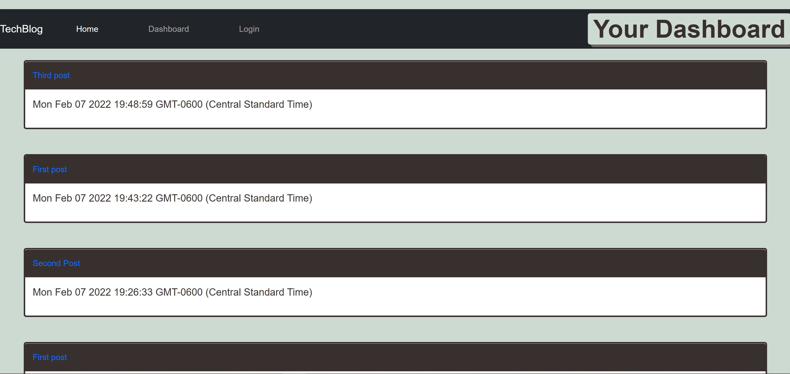

# Tech-Blog
This is a tech blog application I made using Handlebars and JavaScript.

 

This is a full-stack application that utilizes handlebars.js and the MVC paradigm to display a blog posting website where users can write posts about technology.

## Installation

1. Clone repository and use Node.js to run the application
2. Use `npm install` in the root directory to install the required npm packages
3. Use `npm start` to start the server.

* Screenshot:

* Website
 https://immense-everglades-65366.herokuapp.com/

## Features

* JavaScript
* Node.js
* MySQL
* Sequelize
* Handlebars.js
* Express.js
* Insomnia
* MVC Paradigm
* npm packages
  * dotenv
  * mysql2
  * bcrypt
 

## Author

Nick Mullenmeister